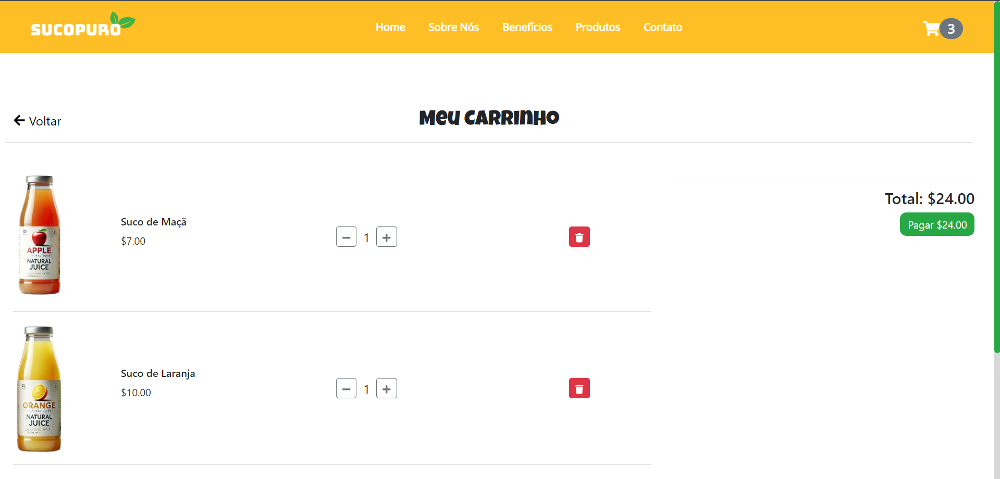

# SucoPuro - Loja Virtual de Sucos Naturais

## Descrição

O SucoPuro é uma loja virtual de sucos naturais, desenvolvida para proporcionar uma experiência de usuário agradável e responsiva. Este projeto foi criado com o objetivo de demonstrar minhas habilidades em desenvolvimento web, utilizando tecnologias modernas e boas práticas de design.

## Funcionalidades

- Homepage Interativa: Animações suaves e design atraente para uma primeira impressão positiva.
- Sobre Nós: Seção destacando a qualidade dos sucos naturais e os benefícios dos produtos.
- Benefícios: Listagem das vantagens de escolher nossos sucos, como a ausência de açúcar adicionado e embalagens ecológicas.
- Produtos: Seção com produtos disponíveis para compra e preços.
- Contato: Informações de contato detalhadas e localização.
- Carrinho de Compras: Funcionalidade completa para adicionar e remover produtos do carrinho.

## Tecnologias Utilizadas

- **React**: Biblioteca JavaScript para construção de interfaces de usuário.
- **Bootstrap**: Framework CSS para design responsivo e componentes prontos.
- **Framer Motion**: Biblioteca para animações em React.
- **React Icons**: Conjunto de ícones para React.
- **JavaScript (ES6+)**: Linguagem de programação para desenvolvimento web.
- **CSS**: Estilização de componentes.
- **HTML**: Estrutura do projeto.

## Como Rodar o Projeto

1. Clone o repositório:

    git clone https://github.com/Viihgx/juice-store

2. Navegue até o diretório do projeto:

    cd juice-store

3. Instale as dependências:

    npm install

4. Inicie o servidor de desenvolvimento:

    npm start

## Screenshots

## Contribuição

Contribuições são bem-vindas! Sinta-se à vontade para abrir uma issue ou enviar um pull request.